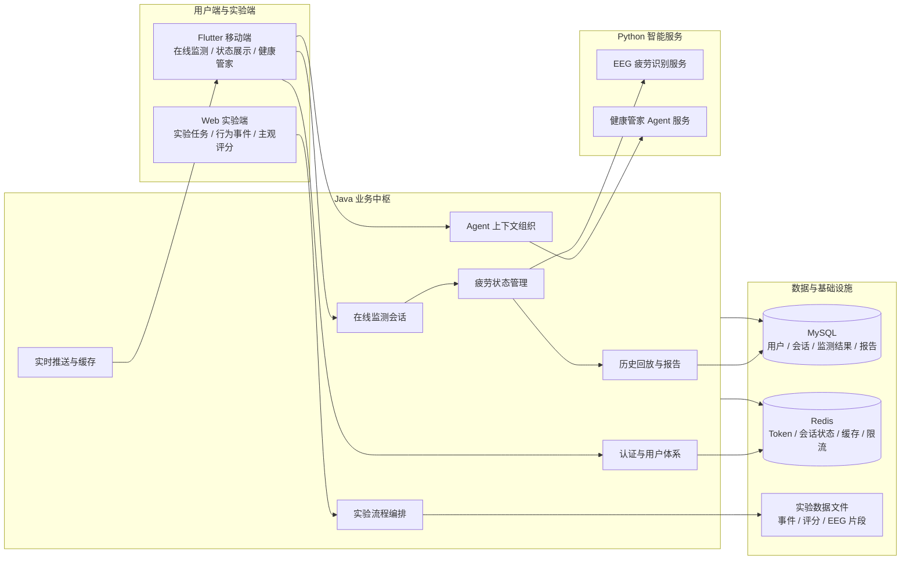
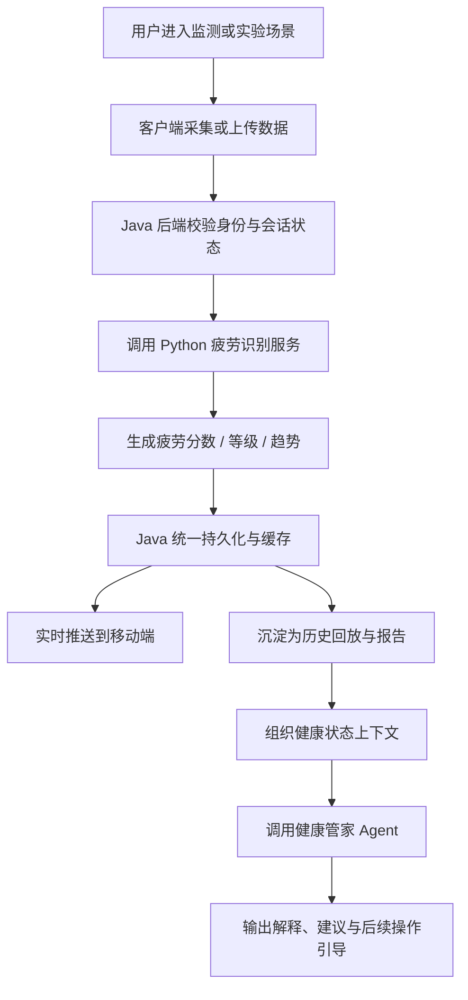

# 基于 EEG 的全栈疲劳监测与智能健康管家系统

> 本仓库为项目展示仓库，用于说明系统定位、总体架构、核心业务链路与工程复杂度。由于项目涉及实验数据、算法实现与源码版权保护，完整源代码暂不公开；仓库中仅展示脱敏后的架构图、流程图、模块说明、演示材料与个人工程实践总结。

## 项目概览

本项目是一套面向办公与实验场景的 **EEG 疲劳监测全栈系统**。系统以 **Java Spring Boot 后端作为业务中枢**，连接 Flutter 移动端、Web 实验端、Python 疲劳识别服务与健康管家 Agent 服务，完成从数据采集、算法推理、状态管理、实时推送、历史回放到智能建议的完整闭环。

与常规后台管理系统不同，本项目并不是围绕单表增删改查展开，而是围绕一个真实监测场景组织多个子系统：移动端负责在线监测与结果展示，Web 端负责实验流程与行为记录，Java 后端负责任务编排、会话管理与数据沉淀，Python 服务负责算法推理与智能建议。项目重点体现 **多端协同、算法服务工程化接入、状态流转、实时通信、数据闭环与智能交互** 等综合工程能力。

## 项目复杂度体现

| 维度 | 复杂度体现 |
| --- | --- |
| 多端协同 | Flutter APP、Web 实验端、Java 后端、Python 算法服务与 Agent 服务共同参与业务闭环 |
| 业务链路 | 覆盖在线监测、实验采集、历史回放、健康管家、报告展示等多个场景 |
| 数据链路 | EEG 数据、实验事件、用户状态、历史趋势、Agent 上下文等多类数据并行流转 |
| 后端编排 | Java 后端统一处理认证、会话、状态、缓存、推送、持久化和服务调用 |
| 实时交互 | 基于 SSE 将疲劳状态实时推送到客户端，提升监测过程的即时反馈能力 |
| 智能化能力 | 将疲劳识别结果、历史状态和用户输入组织为健康管家 Agent 的上下文输入 |
| 工程展示 | 通过架构图、流程图、接口概览、演示视频和简历表述展示项目成果 |

## 总体架构



## 核心业务闭环



## 功能模块

| 模块 | 说明 |
| --- | --- |
| 用户与认证 | 支持登录态管理、Token 校验、接口访问控制，为移动端和 Web 端提供统一身份入口 |
| 在线疲劳监测 | 面向移动端在线监测流程，支持监测会话、疲劳状态更新、实时展示与结果记录 |
| 实验采集协同 | 面向实验任务场景，协调 APP 与 Web 端的会话绑定、任务状态与数据上传 |
| 疲劳算法服务 | 将 EEG 疲劳识别能力封装为独立 Python 服务，由 Java 后端统一调用和管理 |
| 历史回放与报告 | 对监测结果进行沉淀与聚合，为趋势查看、历史复盘和后续分析提供数据基础 |
| 健康管家 Agent | 基于当前疲劳状态、历史信息和用户问题生成解释与建议，增强系统交互能力 |
| 缓存与实时推送 | 使用 Redis / Caffeine / SSE 等机制支撑登录态、状态缓存和实时结果展示 |

## 与普通系统的区别

普通管理系统通常以“页面 + 表单 + 数据库 CRUD”为主，业务链路相对短，系统边界清晰。本项目的复杂度主要来自 **多端、多服务、多数据流和智能化能力的组合**：

- 前端不是单一页面，而是同时包含移动端监测和 Web 实验端。
- 后端不是简单接口层，而是承担业务中枢和服务编排角色。
- 数据不只是业务表单，还包含 EEG 片段、实验事件、疲劳状态、历史趋势和 Agent 上下文。
- Python 服务不是简单脚本，而是被纳入后端业务链路，以服务化方式参与系统闭环。
- 智能健康管家不是独立聊天页面，而是与疲劳状态、历史记录和业务规则结合。

## 技术栈

| 层级 | 技术 |
| --- | --- |
| 移动端 | Flutter、Dart、图表展示、接口封装、状态展示 |
| Web 端 | Vite / TypeScript、实验任务页面、事件记录、结果展示 |
| 后端 | Java、Spring Boot、Spring Security、MyBatis-Plus、AOP、SSE |
| 算法服务 | Python、FastAPI、EEG 数据处理、模型推理服务化 |
| Agent 服务 | Python、上下文组织、规则约束、Prompt、RAG / LLM 接入 |
| 数据与中间件 | MySQL、Redis、Caffeine、实验文件存储 |
| 工程化 | Docker Compose、环境变量配置、接口文档、演示材料、模块化文档 |

## 展示仓库内容

```text
fatigue-showcase/
├── README.md                     # 项目总览与架构展示
├── docs/
│   ├── architecture.md            # 总体架构与模块边界
│   ├── api-overview.md            # 脱敏接口概览
│   ├── testing-strategy.md        # 测试与验证思路
│   ├── engineering-practices.md   # 工程实践总结
│   ├── resume-snippets.md         # 简历表述参考
│   ├── demo.md                    # 演示视频与截图说明
│   ├── diagrams/                  # 架构图与流程图
│   └── screenshots/               # 功能截图
├── .env.example
├── .gitignore
└── LICENSE
```

## 演示材料建议

建议在公开仓库中补充以下材料，用于增强可信度和展示效果：

1. Flutter 移动端首页、实时监测页、健康管家页截图。
2. Web 实验端任务页面、评分页面、实验结束页面截图。
3. 一段 1～3 分钟的演示视频，展示“开始监测 → 疲劳状态变化 → 健康管家建议”。
4. 系统架构图和核心业务流程图的 PNG / SVG 版本。
5. 脱敏后的接口概览和模块说明。

## 项目边界说明

本仓库用于展示项目架构与工程实践，不公开完整源码、真实实验数据、模型权重、密钥配置或用户信息。文档中的架构图、接口说明和流程图均经过脱敏处理，用于说明系统设计思路与个人参与工作。
