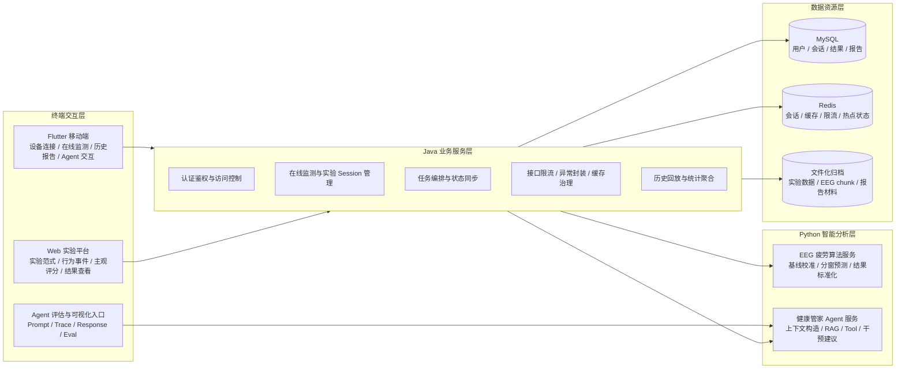
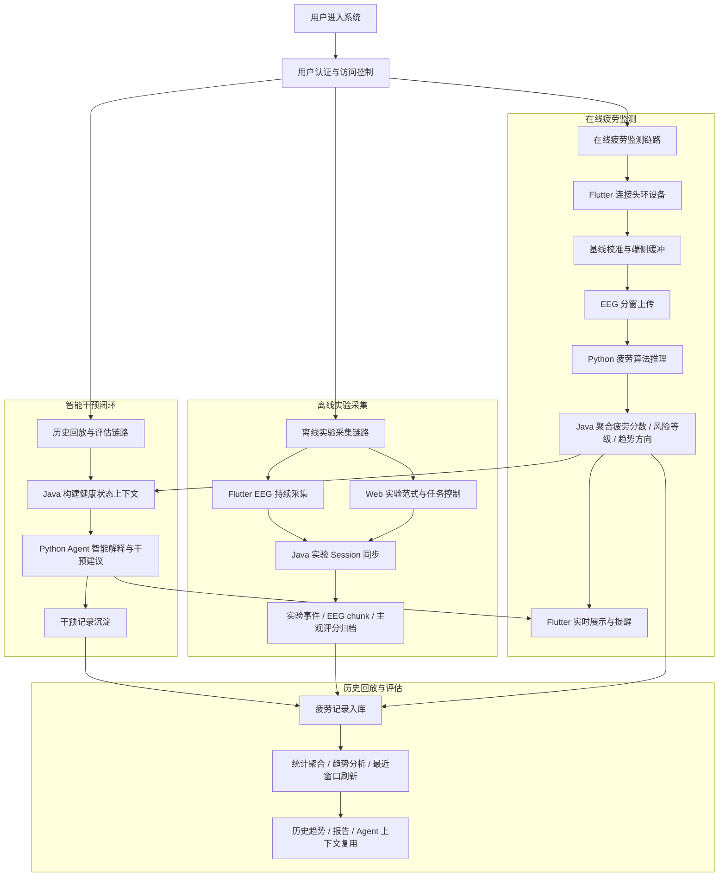
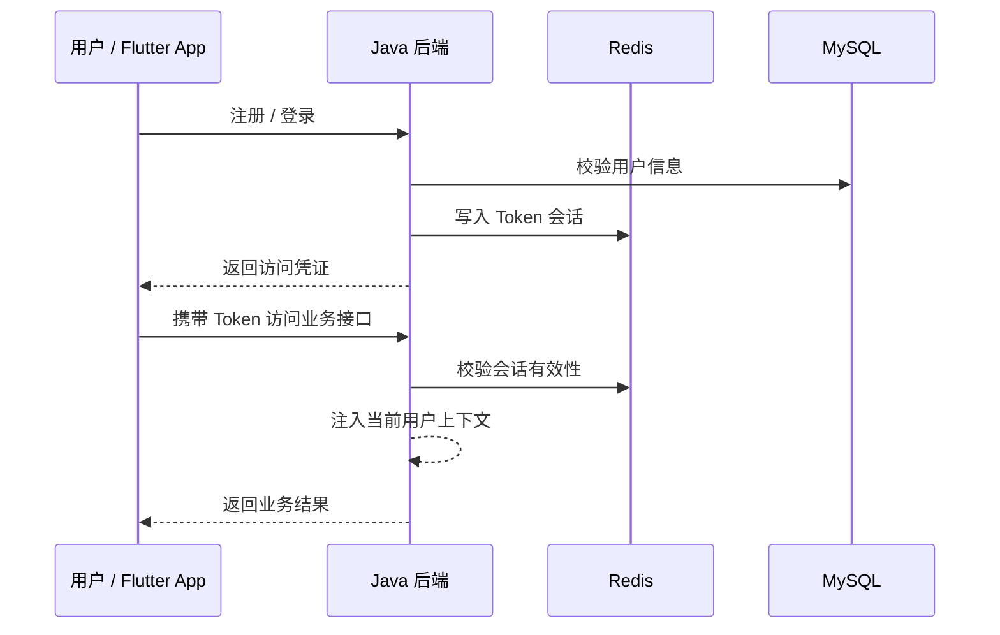
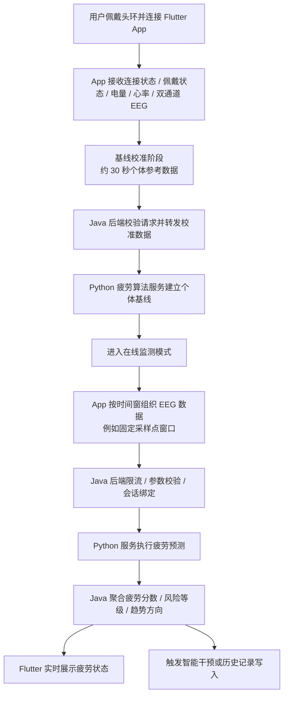
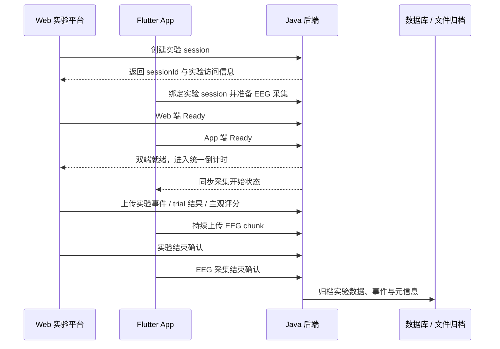
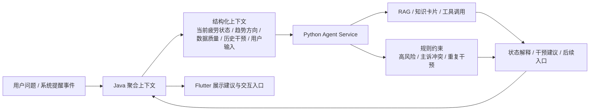
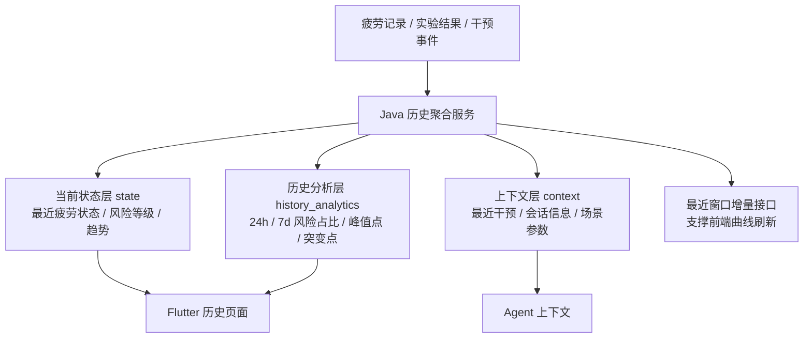

# 疲劳监测与智能干预 Agent 系统

> 本仓库为项目展示仓库，用于说明系统架构、业务链路、前后端协同方式、算法服务接入与 Agent 智能干预闭环。由于项目涉及源代码版权、实验数据与设备采集链路，完整源码暂不公开；本仓库仅展示脱敏后的架构设计、业务流程、接口边界与演示材料入口。

## 1. 项目定位

本项目面向办公、学习、实验研究与长时间脑力劳动等疲劳监测场景，构建了一套从 **EEG 数据采集、疲劳状态识别、风险评估、智能干预到历史回放** 的多端协同系统。

系统不是单一算法 Demo，也不是传统后台管理系统，而是围绕真实设备接入和疲劳监测业务闭环构建的全栈工程系统。整体采用：

- **三端接入**：Flutter 移动端、Web 实验平台、Agent/评估可视化入口
- **后端统一编排**：Java Spring Boot 负责认证、会话、状态同步、限流、缓存、算法调用和结果管理
- **Python 分层计算**：Python 疲劳算法服务负责 EEG 校准与在线推理，Python Agent 服务负责智能解释与干预建议
- **数据分层存储**：MySQL 保存业务数据，Redis/Caffeine 支撑高频状态查询，文件化归档支撑实验数据与后续分析

系统同时支持 **在线疲劳监测** 与 **离线实验数据采集** 两条主链路：前者面向实时风险提示和用户交互，后者面向标准化实验采集、算法适配与科研分析。

## 2. 项目复杂度概览

| 维度 | 说明 |
| --- | --- |
| 前端工程 | Flutter 移动端、Web 实验平台、Agent/评估可视化入口 |
| 后端工程 | Java Spring Boot 业务中台，统一处理认证、会话、缓存、限流、状态同步与服务编排 |
| 算法服务 | Python EEG 疲劳识别服务，支持基线校准、分窗推理与结果标准化 |
| Agent 服务 | Python Agent Service，支持上下文构造、RAG/工具调用、状态解释和干预建议生成 |
| 数据链路 | 在线实时监测数据、离线实验 session、行为事件、疲劳结果、干预记录、历史回放视图 |
| 工程规模 | 项目包含多个前后端与算法服务子工程，核心源码规模约 5-6 万行 |

## 3. 总体架构

### 3.1 系统分层架构




### 3.2 系统业务总览

总体分层架构用于说明“有哪些系统角色”，业务总览图用于说明“这些角色如何围绕疲劳监测闭环协同”。



## 4. 核心业务链路

### 4.1 用户登录与基础能力链路

基础链路负责支撑后续在线监测、离线实验、Agent 交互和历史回放。系统采用 Token + Redis 会话方式管理登录态，Java 后端通过统一过滤链完成身份识别，并在高频接口前引入限流、异常封装和缓存治理能力。



该链路的价值不只是“登录”，而是为多端数据隔离、在线监测会话、实验 session 绑定和 Agent 上下文构造提供统一身份基础。

### 4.2 在线疲劳监测链路

在线监测链路面向实时疲劳感知场景。Flutter 移动端负责头环连接、设备状态展示、EEG 数据接收、基线校准缓冲和预测窗口组织；Java 后端负责认证、限流、请求编排、算法服务调用、结果聚合和状态推送；Python 疲劳算法服务负责基线建立和在线推理。



该链路体现的是“设备数据 → 个体基线 → 分窗预测 → 风险状态 → 实时反馈”的完整闭环，而不是简单调用一次模型接口。

### 4.3 离线实验数据采集链路

离线实验链路面向标准化实验采集和算法迭代。Web 实验端负责实验范式、静息段/任务段控制、行为事件、trial 结果和主观评分；Flutter App 负责 EEG 持续采集、chunk 分段上传和结束确认；Java 后端负责 session 创建、双端 ready 判断、统一倒计时、状态推进和最终归档。



该链路的核心在于保证 **行为事件与 EEG 数据处于同一实验会话边界内**，后续可用于模型适配、特征分析和科研验证。

### 4.4 Agent 智能干预链路

Agent 不被设计成脱离业务数据的普通聊天机器人，而是建立在当前在线监测 session、实时疲劳状态、历史趋势、近期干预记录和用户输入之上。Java 后端负责将业务数据聚合为结构化上下文，Python Agent 服务负责解释、建议和交互响应。



该链路强调的是“受业务上下文约束的健康建议生成”，而不是泛化聊天能力。

### 4.5 历史回放与评估链路

历史回放链路用于将实时监测结果、实验结果和干预事件重新组织为可展示、可复用的健康视图。它既服务于用户趋势查看，也服务于 Agent 上下文构造、日报周报生成和系统评估。



历史回放不是简单查询数据库明细，而是将原始记录聚合为可视化、可解释、可复用的数据视图。

## 5. 划分

该展示仓库按照业务逻辑划分。

- 用户登录与基础链路说明系统入口和工程治理能力
- 在线疲劳监测链路说明真实设备数据如何进入业务闭环
- 离线实验采集链路说明 Web 端、App 端和后端如何协同完成标准化数据采集
- Agent 智能干预链路说明 AI 能力如何接入真实业务上下文
- 历史回放链路说明系统如何从单次预测扩展到长期趋势、评估和复用

## 6. 仓库内容

```text
.
├── README.md
├── docs/
│   ├── architecture.md          # 系统分层架构与业务链路设计
│   ├── business-workflows.md    # 按业务逻辑拆分的核心流程图
│   ├── api-overview.md          # 脱敏接口概览
│   ├── testing-strategy.md      # 测试与验证策略概览
│   ├── diagrams/                # 可放置架构图、流程图导出图片
│   └── screenshots/             # 可放置系统截图
├── LICENSE
└── .gitignore
```

## 7. 项目边界说明

本仓库不公开完整源码、真实实验数据、模型权重、密钥配置和可识别用户数据。公开内容仅用于展示系统设计、工程复杂度、业务链路和项目实现思路。

