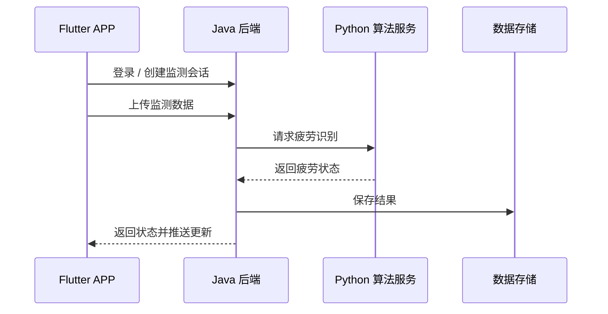
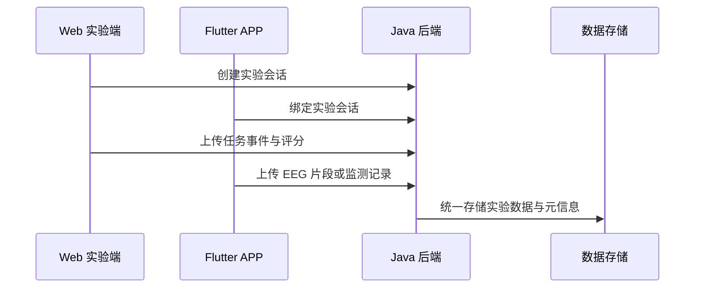

# 接口概览（脱敏）

本文件仅展示接口分组和业务边界，不包含完整源码、真实地址、密钥或敏感参数。

## 接口分组

| 分组 | 说明 |
| --- | --- |
| 用户认证 | 登录、登出、Token 校验、用户信息获取 |
| 在线监测 | 创建监测会话、上传监测数据、查询最新疲劳状态、获取趋势数据 |
| 实验采集 | 创建实验会话、APP/Web 绑定、状态同步、上传实验事件与评分数据 |
| 疲劳算法 | Java 后端调用 Python 服务，完成疲劳识别与结果返回 |
| 历史回放 | 查询历史监测记录、趋势数据、阶段报告和汇总结果 |
| 健康管家 | 发送用户问题，结合当前状态和历史信息返回解释与建议 |
| 实时推送 | 建立 SSE 连接，向客户端推送疲劳状态变化 |

## 典型调用流程

### 在线监测流程

### 实验采集流程

## 说明

公开文档中不展示完整接口路径、真实请求体、认证信息或业务敏感字段。面试沟通中可结合系统架构图和演示视频说明接口设计思路、模块边界和业务链路。
