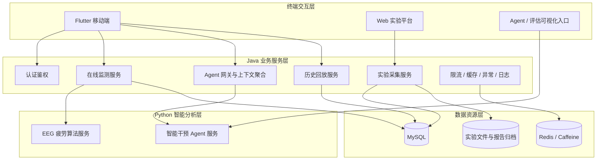

# 系统架构与业务链路设计

## 1. 架构设计思路

系统采用“三端接入、后端统一编排、Python 分层计算、数据分层存储”的总体架构。

- **三端接入**：Flutter 移动端负责在线监测和用户交互；Web 实验平台负责实验范式执行和行为数据采集；Agent/评估可视化入口用于观察智能服务运行过程。
- **后端统一编排**：Java Spring Boot 后端承担认证、访问控制、接口限流、会话管理、状态同步、算法服务调用和结果管理。
- **Python 分层计算**：疲劳算法服务负责 EEG 基线校准与分窗预测；Agent 服务负责状态解释、干预建议和报告增强生成。
- **数据分层存储**：MySQL 负责业务数据持久化；Redis/Caffeine 负责会话、缓存、限流和热点状态；文件化归档负责实验数据与报告材料。

## 2. 业务链路划分

相比按技术模块展示，本项目更适合按业务链路展示。系统最终形成五条主要链路：

1. 用户登录与基础能力链路
2. 在线疲劳监测链路
3. 离线实验数据采集链路
4. Agent 智能干预链路
5. 历史回放与评估链路

这种划分能够体现系统不是几个独立模块的简单拼接，而是围绕疲劳监测场景形成的完整闭环。

## 3. 前端工程边界

### 3.1 Flutter 移动端

Flutter 移动端主要面向用户侧在线监测与反馈，包含：

- 用户注册登录
- 头环设备连接与状态展示
- EEG 实时波形展示
- 基线校准与监测模式切换
- 疲劳评分、风险等级、趋势状态展示
- 历史记录与报告查看
- 健康管家 Agent 交互入口

移动端不仅是展示层，还承担一部分实时采集入口和数据组织职责，例如基线缓冲、预测窗口组织和设备状态分流。

### 3.2 Web 实验平台

Web 实验平台主要面向标准化实验采集场景，包含：

- 实验 session 创建与加入
- 实验范式执行
- 静息段与任务段控制
- 行为事件记录
- trial 结果上传
- 主观评分采集
- 实验结果查看

Web 实验端与 Flutter App 通过 Java 后端进行同一 session 下的状态同步，从而保证行为事件与 EEG 数据能够被关联和追溯。

### 3.3 Agent / 评估可视化入口

Agent 评估入口主要面向开发和调试场景，用于观察智能服务的输入上下文、响应结果和评估信息。它不是普通用户主链路，但能支撑 Agent 效果分析和问题定位。

## 4. Java 后端角色

Java 后端在系统中承担业务中枢角色，主要负责：

- 统一认证鉴权与用户上下文注入
- 在线监测 session 管理
- 实验 session 状态推进
- 高频接口限流与异常封装
- Redis/Caffeine 缓存治理
- 调用 Python 疲劳算法服务
- 聚合 Agent 所需的结构化上下文
- 保存疲劳记录、干预记录和历史回放数据

Java 后端不直接承担复杂 EEG 推理和大模型生成任务，而是负责把这些智能能力稳定接入业务系统。

## 5. Python 服务角色

Python 层被拆分为两个相对独立的服务角色：

- **疲劳算法服务**：负责 EEG 数据预处理、基线校准、特征计算、模型推理和结果标准化。
- **Agent 智能干预服务**：负责基于结构化上下文生成解释、建议和后续交互内容。

这种拆分能够减少主业务系统与算法/大模型逻辑之间的耦合，也便于后续算法更新、模型替换和 Agent 能力演进。
