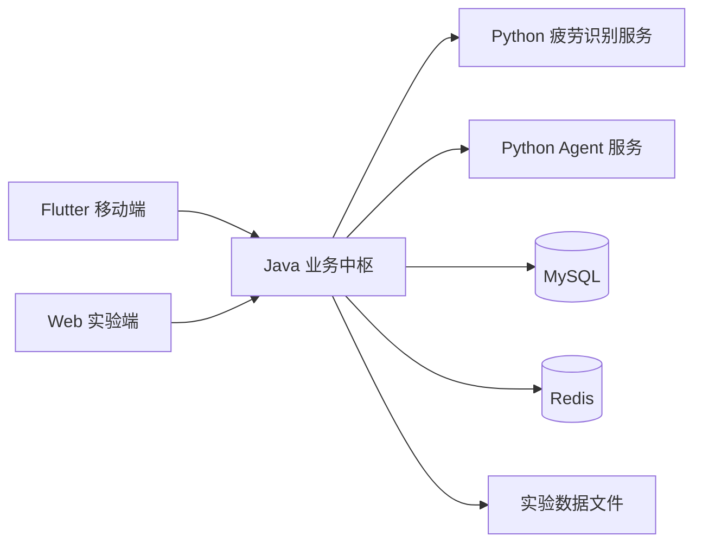
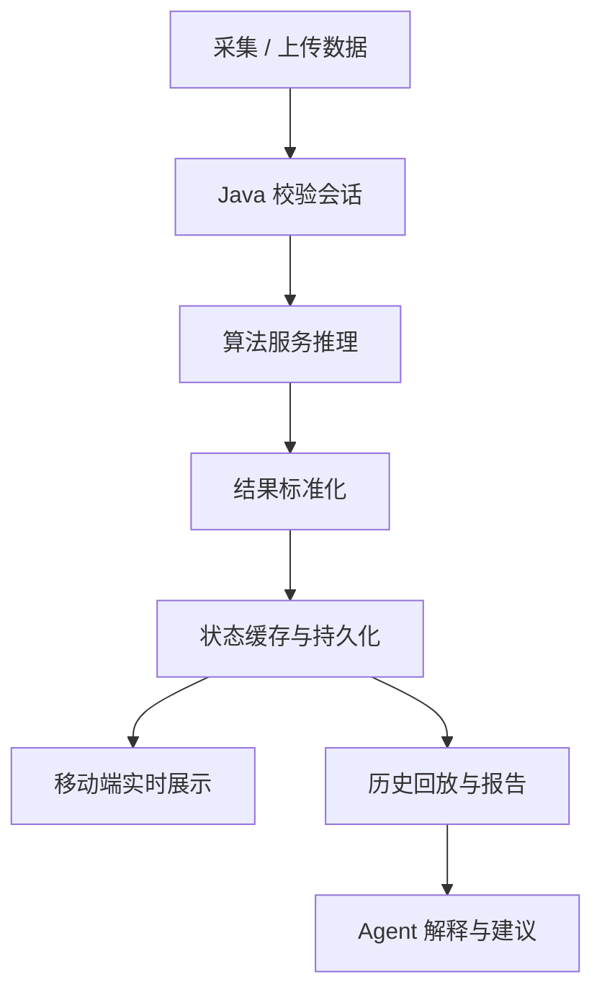

# 系统架构说明

本项目采用“多端入口 + Java 业务中枢 + Python 智能服务 + 数据基础设施”的整体架构。展示文档重点呈现项目复杂度和系统边界，不展开过细的实现细节，便于后续根据实际版本继续迭代。

## 架构定位

系统围绕 EEG 疲劳监测场景构建，核心目标是将采集、推理、展示、历史沉淀和智能建议连接成一个完整闭环。

## 模块边界

| 模块 | 主要职责 |
| --- | --- |
| Flutter 移动端 | 在线监测、疲劳状态展示、健康管家交互、历史结果查看 |
| Web 实验端 | 实验任务展示、行为事件记录、主观评分与实验流程协同 |
| Java 后端 | 认证、会话、状态流转、服务编排、数据持久化、缓存与实时推送 |
| Python 算法服务 | 承接 EEG 疲劳识别能力，对外提供算法推理接口 |
| Python Agent 服务 | 基于业务上下文生成解释和建议，增强系统智能交互能力 |
| MySQL / Redis | 存储业务数据、监测结果、登录状态、缓存与会话状态 |

## 设计取舍

- **Java 作为业务中枢**：避免移动端和 Web 端直接耦合算法服务，统一处理权限、会话、状态和数据落库。
- **Python 服务独立部署**：算法和 Agent 能力迭代较快，独立服务化便于替换、扩展和调试。
- **SSE 用于实时状态推送**：在线监测主要是服务端向客户端推送状态，SSE 能降低实时展示链路的接入复杂度。
- **展示仓库不公开源码**：项目涉及实验数据与源码保护，公开仓库仅展示脱敏后的系统设计和演示材料。

## 宏观业务链路

