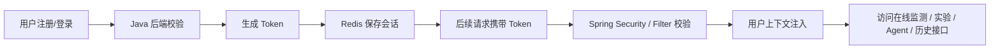
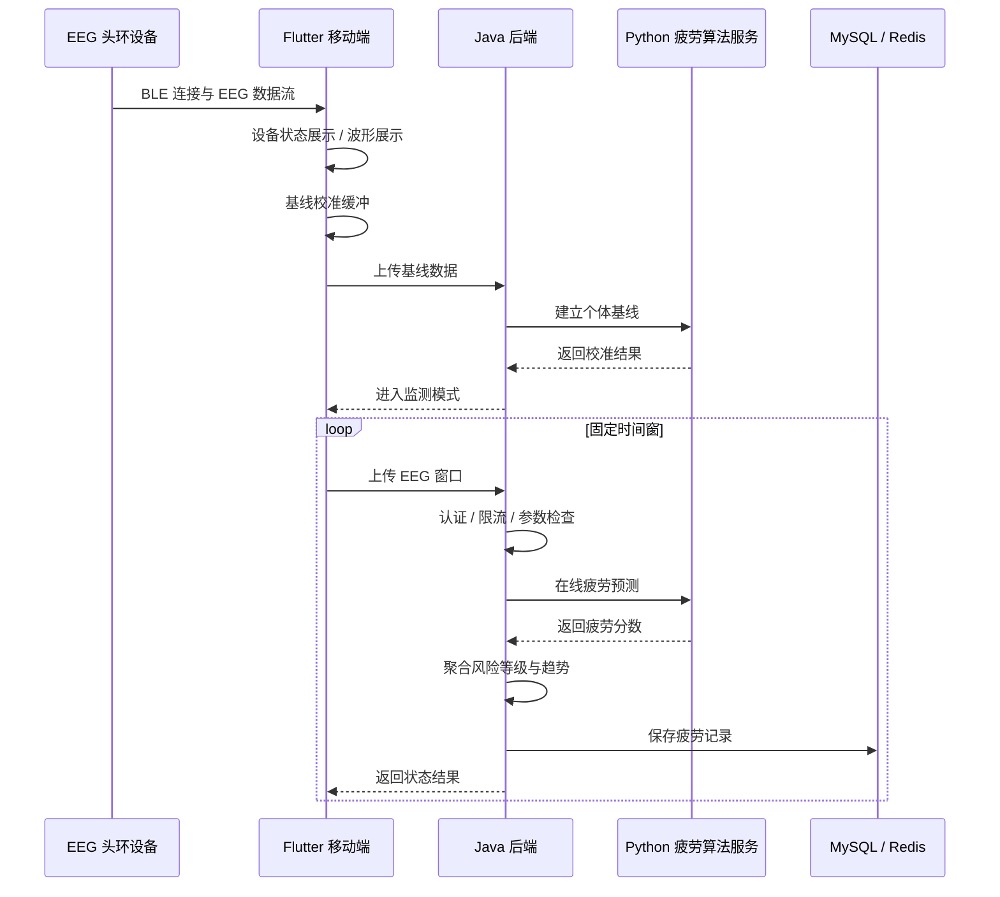
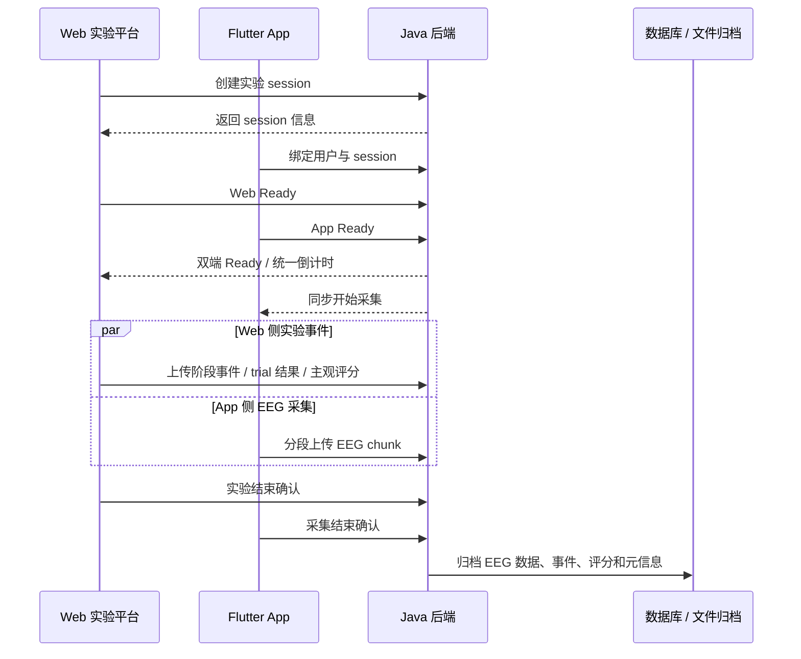
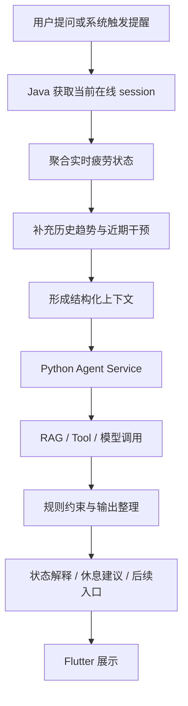
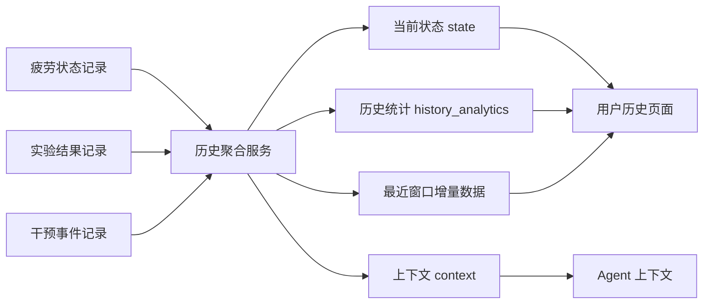
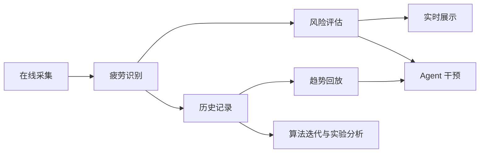

# 核心业务流程图

本文档按业务逻辑展示系统链路，避免仅用一张总图概括复杂系统。

## 1. 用户登录与基础能力链路

基础链路支撑的是后续所有业务的数据隔离和访问控制。

## 2. 在线疲劳监测链路

## 3. 离线实验数据采集链路

## 4. Agent 智能干预链路

## 5. 历史回放与评估链路

## 6. 系统闭环

该闭环体现系统从单一预测扩展到长期评估和智能干预的能力。
